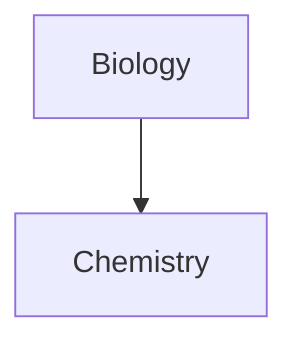

# 第一课

## 特点

- 支持markdown
- 双链笔记
- 丰富的插件系统
- 强大的自定义模板
- 纯文本（便于在不同工具展示）
- 本地化资料库
- 支持同步
- 支持发布
- ......

## 定位

### 不是什么

- 不是收集工具
- 不是word
- 不是时间管理工具

### 是什么

- 码字工具
- 深度知识管理工具
	- 内容为基础
	- 链接为核心

## 用来做什么

- 码字
- 建立深度知识库
	- 关联知识点
	- 发现新知识点
- 建立索引
- 写清单日记

# 第二课

## 知识的管理流程

- 学习知识
- 保存知识

	- 输出，markdown
	- 整理，双链
	
- 使用知识
- 共享知识
- 创新知识

## markdown语法

### 常用语法

- 标题#
- 加粗**加粗**
- 斜体*斜体*
- 删除线~~删除线~~
- 列表

	- 有序列表
		1. 有序列表
	- 无序列表
		- 无序列表
	
- 引用> 引用
- 分割线
---

- 链接[obsidian学习笔记](https://www.bilibili.com/video/BV1H44y1n71k?t=0.0)
```c
```
- 任务列表
- [ ] 任务列表

### 高阶用法

- [输出公式](https://www.zybuluo.com/codeep/note/163962)
- 绘制流程图(mermaid)

# 第三课

## 双链
### 意义
- 带来新的思维
- 管理知识片段
- 线性笔记
- 整合有价值的片段
- 片段成文
- 深度知识库
### 如何应用
- 链接文章[[]]
- 链接别名[[|]]
- 显示内容![[]]
# 第四课
## 模板
### 意义
- 结构相同
- 内容不同
### 高重复性笔记:
- 读书笔记
- 会议记录
- 日记
# 第五课
## 插件

- 软件本身的功能最重要
- 不要改变软件本身的定位

# 第六课
## 搜索的技巧
- 搜索：针对**内容**的查找
- 查询：针对**属性**的展示
## 在Obsidian中的搜索
- 快捷键
	- 搜索当前文档：Ctrl+f
	- 搜索整个资料库：Ctrl+Shift+f
## 搜索技巧
- 直接搜索关键词
- 搜索包含多个关键的文档（空格间隔）
- 搜索包含某一个关键词的文档（OR）
- 指定搜索范围
	- 搜索文件名file：word
	- 搜索文本内容content：word
	- 搜索标签tag:#tag；word
	- 搜索同一行中的多个关键词line:word1 word2
	- 搜索同一章节中的多个关键词section：word1 word2
	- 搜索同一段落（块）中的多个关键词block:word1 word2
- 搜索任务task:""
# 第七课
## dataview学习
- 建立数据库
- 生成目录
- ![[Pasted image 20230814100359.png]]
- ![[Pasted image 20230814100443.png]]
- [Obsidian Dataview学习](https://zhuanlan.zhihu.com/p/373623264)
- 对Obsidian进阶学习
# 第八课
## 白板使用
- 接入视频
- 做笔记


